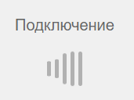
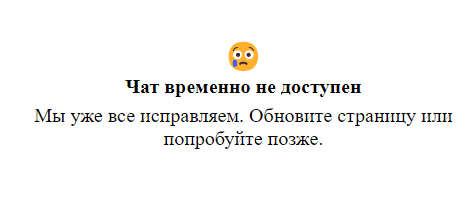

IQChannels Widget
=================

* [Использование](#использование)
  * [1\. Описание](#1-описание)
  * [2\. Принцип работы](#2-принцип-работы)
  * [3\. Установка](#3-установка)
    * [3\.1\. Загрузка API виджета](#31-загрузка-api-виджета)
    * [3\.2\. Инициализация виджета](#32-инициализация-виджета)
      * [3\.2\.1\. Защищенная зона (интернет\-банк)](#321-защищенная-зона-интернет-банк)
      * [3\.2\.2\. Анонимная версия (сайт)](#322-анонимная-версия-сайт)
    * [3\.3\. Настройка виджета](#33-настройка-виджета)
  * [4\. Программное управление виджетом](#4-программное-управление-виджетом)
    * [4\.1\. Методы](#41-методы)
    * [4\.3\. События](#43-события)
  * [5\. Push-уведомления](#5-push-уведомления)
  * [6\. Стилизация виджета](#6-стилизация-виджета)
    * [6\.1\. Основные компоненты](#61-основные-компоненты)
* [Разработка](#разработка)
* [Зависимости](#зависимости)

# Использование

## 1. Описание
Виджет позволяет интегрировать функцию мессенджера на любой вебсайт.


## 2. Принцип работы
Виджет состоит из двух частей:
* Подключаемый JavaScript с API для работы с виджетом.
* Виджет, который открывается в скрытом айфрейме поверх сайта.

На сайт устанавливается скрипт API, который после инициализации добавляет скрытый iFrame c виджетом.
API предоставляет простой интерфейс по управлению виджетом, открыть, закрыть и т.д.

Виджет всегда занимает фиксированную позицию справа и при открытии устанавливает отступ для контента всей страницы, 
так чтобы виджет не перекрывал собой никакую часть сайта.


## 3. Установка
* Предположим, IQChannels установлен и доступен по адресу http://localhost:3001/
* Пример виджета можно посмотреть по адресу http://localhost:3001/widget/example.html


### 3.1. Загрузка API виджета 
Для этого в тег HEAD добавляем:
```
<script type="text/javascript" src="http://localhost:3001/widget/widget.min.js"></script>
```


### 3.2. Инициализация виджета
Виджет может быть инициализирован как анонимный (для размещения на любом сайте без авторизации), 
либо в защищенном режиме, если он встраивается личный кабинет, защищенный паролем (интернет-банк).


#### 3.2.1. Защищенная зона (интернет-банк)
Для инициализации виджета необходимо знать название канала для подключения и авторизационные данные клиента.
Далее в любом месте тега BODY вставляем скрипт:
```html
<script type="text/javascript">
    var widget = new IQChannelsWidget({ 
        channel: 'support',
        credentials: 'user-token',
        mode: 'web'
    });
</script>
```

Где:
* `channel` — имя канала для подключения (тип канала в IQChannels должен быть `Веб / мобильный`).
* `credentials` — авторизационные данные для авторизации клиента в iSimpleBank.

После этого виджет полностью готов к работе.

**Важно!**
При вызоде клиента из защищенной зоны (разлогинивание), важно вызвать метод `logout()` у виджета, подробнее ниже.


#### 3.2.2. Анонимная версия (сайт)
Инициализация полностью идентична, за исключением:

* Параметр `credentials` необходимо оставить пустым, либо не передавать вообще.
* Тип канала в IQChannels должен быть `Веб — анонимный`.
* Вызывать метод `logout()` виджета не нужно. Анонимные клиенты имеют возможность самостоятельно разлогиниться 
  и удалить историю перепискииз их браузера.

Например:
```html
<script type="text/javascript">
    var widget = new IQChannelsWidget({ 
        channel: 'support'
    });
</script>
```

### 3.3. Настройка виджета

Настройки виджета:
```html
<script type="text/javascript">
var widget = new IQChannelsWidget({ 
    channel: 'support',
    credentials: 'some user secret',
    mode: 'web', // web || mobile
    width: 280,
    padBody: true,
    requireName: false,
    iconOptions: {
        show: true,
        color: "#000000",
        backgroundColor: "#FFFFFF",
        style: {}
    },
    url: 'https://app.iqstore.ru/widget/', 
    imgModalOptions: {
        enabled: true,
        state: 'mobile',
    },
});
</script>
```

Параметры:
* `mode` - режим работы виджета `web` или `mobile`, по умолчанию `web`, в мобильном режиме отключается открытие файлов в новых вкладках браузера.
* `width` — ширина виджета в пикселях.
* `padBody` — автоматическое добавление паддинга к тегу `body` при открытии виджета.
* `requireName` — выключает требование представиться у анонимного клиента.
* `iconOptions` — настройки отображения кнопки виджета.
* `iconOptions.show` — отображать кнопку или нет.
* `iconOptions.style` — дополнительные CSS-стили для кнопки.
* `iconOptions.color` — цвет иконки.
* `iconOptions.backgroundColor` — цвет фона кнопки.
* `url` — опциональный адрес сервера с виджетом, если не указан, то определяется автоматически.
* `imgModalOptions` — настройки отображение изображений в модальном окне. Значение по умолчанию: `{ enabled: true, state: 'full'}`.
* `imgModalOptions.enabled` — включает отображение изображений в модальном окне. При значении `false` изображения открываются в новой вкладке.
* `imgModalOptions.state` — режим отображение модального окна с изображением. При значении `full` модальное окно открывается во все окно браузера, при значении `mobile` модальное окно открывается в рамках окна чата.


Параметры для работы с кросс-сегментностью:
* `channel, credentials` — убираются, переходят в раздел `chats`.
* `chats` — поле для нескольких чатов, где передаются два параметра.
* `chats.channel` — имя канала для подключения.
* `chats.credentials` — авторизационные данные для авторизации клиента.

Для более глубокой стилизации виджета см. раздел "6. Стилизация виджета".

## 4. Программное управление виджетом
В случае если кнопка управления виджетом по умолчанию не устраивает, она может быть отключена 
и реализована самостоятельно.

Для этого виджет предоставляет набор методов и событий, используя которые, 
можно реализовать интерфейс управления виджетом любой сложности.
 
### 4.1. Методы
После инициализации виджет находится в скрытом состоянии. Чтобы показать его пользователю, 
необходимо вызвать метод `open()`:
```javascript
widget.open();
```

Также можно открывать виджет сразу с текстом сообщения:
```javascript
widget.open('Текст сообщения пользователя');
```

Текст сообщения также можно добавить с помощью метода `appendText()`:
```javascript
widget.appendText('Текст сообщения пользователя');
```

Скрыть виджет можно либо кликнув по кнопке закрыть в интерфейсе виджета, либо программно:
```javascript
widget.close();
```

Также API предоставляет метод смены состояния `toggle`, который показывает или скрывает виджет:
```javascript
widget.toggle();
```

Если виджет расположен в защищенной зоне и при инициализации использовались `credentials`, 
то при выходе из защищенной зоны необходимо в обязательном порядке вызвать метод `logout()`, 
чтобы закрыть текущую сессию пользователя и предотвратить неавторизованный доступ к переписк:
```javascript
widget.logout();
```

Уничтожение виджета, удаляет чат и кнопку:
```javascript
widget.destroy();
```

Управление пуш-токеном для нативных пушей через APNS (iPhone) и FCM (Android). Инструкции см. ниже.
```javascript
widget.setIPhonePushToken("my-iphone-token");
widget.setAndroidPushToken("my-android-token");
```

Ручное обновление авторизованного клиента из CRM:
```javascript
widget.refreshClient();
```

### 4.3. События
События на которые можно подписаться использую стандартный для JavasScript интерфейс `EventEmitter`:
```javascript
widget.on('close', function () {
    console.log('Виджет закрыт');
});
```

```javascript
widget.on('open', function () {
    console.log('Виджет открыт');
});
```

```javascript
widget.on('message', function () {
    console.log('Новое сообщение');
});
```
С помощью события `message` например, можно проиграть звук, если виджет скрыт, а пользователю пришло сообщение.

```javascript
widget.on('unread', function (count) {
    console.log('Количество непрочитанных сообщений', count);
});
```

С помощью события `unread` можно показывать пользователю количество непрочитанных сообщений. 
Событие возникает всякий раз, когда значение меняется. При первоначальном получении списка сообщений, 
если непрочитанных нет, то события не будет. Предполагается, что подписчик инициализирует счетчик сообщений как 0.  

```javascript
widget.on('file-clicked', function (url) {
    console.log('Пользователь нажал на файл, подписанная ссылка:', url);
}
```
Событие `file-clicked` отправляется только в режиме виджета `mobile` и передает подписанную
ссылку на файл, на который нажал пользователь. Ссылка действует ограниченное количество времени.
Время жизни настраивается на сервере.

```javascript
widget.on('error', function (url) {
    console.log('Ошибка:', url);
}
```
Событие `error` отправляется в случаях:
  1. Если Vue приложение еще не запущено - Ошибки хоста виджета;
  2. Если Vue приложение уже запущено - Ошибки связи с сервером;

```javascript
widget.on('ready', function () {
    console.log('Виджет готов к использованию!');
}
```
Событие `ready` отправляется только в случае, если Vue приложение уже запущено и связь с сервером была восстановлена.

## 5. Push-уведомления
Виджет поддерживает нативные пуш-уведомления для мобильных телефонов при интеграции через
Ionic или React Native, но проставлять пуш-токен нужно вручную.

**Инструкция по настройке**

1. Зарегистрируйте телефон для получения пуш-уведомлений через нативное API. См. https://ionicframework.com/docs/native/push#usage

2. Получите токен через уведомление об успешной регистрации в нативном API:
```javascript
pushObject.on('registration').subscribe((registration: any) => console.log('Device registered', registration));
```

3. Перейдайте токен в виджет чата:
```javascript
// Для Айфона.
widget.setIPhoneToken(tokenString);

// Для Андроида.
widget.setAndroidToken(tokenString);
```

4. Пуш-токен будет отправлен на сервер чата, когда клиент будет авторизован.


## 6. Стилизация виджета
Стилизация виджета возможна в двух вариантах:
- Стилизация кнопки виджета.
- Стилизация окна с сообщениями.

Для стилизации окна с сообщениями требуется:
- Перейти в требуемый Проект.
- Перейти в раздел Каналы.
- Выбрать нужный канал с чатом.
- Перейти во вкладку Настройки.
- Указать кастомные стили виджета или указать ссылку на внешнюю таблицу стилей.
- Сохранить настройки.

Для стилизации иконки требуется переопределить стандарные стили кнопки с помощью CSS:
```css
/* Контейнер, в котором показывается переписка */
#iqchannels-widget-container {
  position: fixed;
  height: 100%;
  min-height: 100%;
  top: 0;
  right: 0;
  width: 0;
  z-index: 10;
  display: none;
}

/* Кнопка виджета */
#iqchannels-widget-icon {
  color: #ffffff;
  background-color: #ee5c13;
  position: fixed;
  right: 20px;
  bottom: 20px;
  width: 48px;
  height: 48px;
  border-radius: 24px;
  line-height: 48px;
  margin-right: 2px;
  margin-bottom: 2px;
}

/* Икона на кнопке виджета */
#iqchannels-widget-icon svg {
  fill: #ffffff;
  width: 24px;
  height: 24px;
  padding: 12px 12px;
}

#iqchannels-widget-icon:hover {
  width: 52px;
  height: 52px;
  border-radius: 26px;
  line-height: 52px;
  margin-right: 0;
  margin-bottom: 0;
}

#iqchannels-widget-icon:hover svg {
  width: 28px;
  height: 28px;
  padding: 12px 12px;
}

@media (max-width: 768px) {
  #iqchannels-widget {
    width: 100% !important;
  }

  #iqchannels-widget-container {
    width: 100% !important;
    height: 100%;
  }
} 
```

### 6.1 Основные компоненты:


```css
#record-start { /* your styles */ }
#record-cancel { /* your styles */ }
#send-msg-btn { /* your styles */ }
#upload-btn { /* your styles */ }

.csm-btn {
    margin-left: 5px;
    height: 35px;
    min-width: 35px;
 }

.button {
    border-radius: 50%;
    color: #ffffff;
    fill: #ffffff;
    background: #EBEBEB;
    display: flex;
    min-width: 32px;
    height: 32px;
    margin-right: 3px;
    align-self: end;
}
.button.button-active:hover {
    background-color: #DCF5C0;
}

.button:hover, .button:active {
    background-color: #dddddd;
}
.button.button-active {
    background-color: #C6E39F;
}
```


```css
#message-textarea { /* your styles */ } 
.composer .textarea {
    background: #F2F3F5;
    width: 80%;
    position: relative;
    border: 2px solid #EBEBEB;
    border-radius: 10px;
}
.composer textarea {
    background-color: transparent;
    padding: 8px 32px 8px 8px;
    border: 0;
    width: 100%;
    outline: none;
    color: #000000;
    -moz-box-sizing: border-box;
    -webkit-box-sizing: border-box;
    box-sizing: border-box;
    float: right;
    clear: both;
    height: 34px;
}
```


```css
#chat {
    width: 100%;
    background-color: white;
    overflow-y: scroll;
    -webkit-touch-callout: none;
    -webkit-user-select: none;
    -khtml-user-select: none;
    -moz-user-select: none;
    -ms-user-select: none;
    user-select: none;
    -webkit-tap-highlight-color: rgba(0, 0, 0, 0);
    flex: 1;
}

#list { /* messages list block */ }

.group.client .message {
    float: right;
    margin-left: auto;
    background-color: #DCF5C0;
    color: #488445;
}
.group.user .message {
    float: left;
    background-color: #f3f3f3;
    color: #656565;
}
.message {
    margin: 2px 8px;
    padding: 0.7rem 1rem 0.7rem 1rem;
    clear: both;
    max-width: 75%;
    border-radius: 10px;
    display: flex;
    flex-direction: column;
}
.avatar {
    margin-left: 8px;
    display: flex;
    align-items: end;
}
.group.user .author {
    float: left;
    margin-top: 8px;
    margin-left: 58px;
}

.author {
    font-size: 13px;
    color: #333333;
    margin-bottom: 5px;
    white-space: nowrap;
}
.group.client .author {
    display: none;
}
.time {
    font-size: 10px;
    color: #5F814A;
    white-space: nowrap;
    clear: both;
    margin: auto 0 0 12px;
    position: relative;
}
.received {
    margin-left: 4px;
}
.read {
    margin-left: -4px;
    position: absolute;
}
.received, .read {
    color: #5F814A;
}
```


```css
.vue-simple-context-menu__item {
    align-items: center;
    color: #333;
    cursor: pointer;
    display: flex;
    padding: 5px 15px;
}
.vue-simple-context-menu .context-menu-option {
    transition: 0.1s ease;
}
.vue-simple-context-menu .context-menu-option:hover {
    background-color: #dedede;
    color: black;
}
```

```css
.circle-chat {
    width: 35px;
    height: 35px;
    border-radius: 100%;
    display: flex;
    align-items: center;
    justify-content: center;
}
```


```css
.header {
    width: 100%;
    background-color: #f0f0f0;
    text-align: center;
    display: flex;
}
.header .content {
    display: table-cell;
    vertical-align: middle;
    text-align: center;
    flex: 1;
}
.header .content .client-name-container {
    display: block;
}
.chat-type-select {
    width: 100%;
    color: inherit;
    background-color: inherit;
    border-radius: 0.25rem;
    border: 1px solid #ced4da;
    padding: .375rem 2.25rem .375rem .75rem;
}
```


```css
.message-wrapper .message-inner .sending {
    background-color: rgba(212, 248, 186, 0.4);
}
.loader {
    display: inline-block;
    float: right;
}
.v-spinner {
    text-align: center;
}
.message .filename {
    display: block;
    font-weight: 700;
}
.message .filesize {
    margin-top: 6px;
    display: block;
    font-weight: 200;
    font-size: 12px;
}
.cancel {
    background-color: rgba(255, 0, 0, 0.4);
}
.retry {
    background-color: rgba(1, 138, 43, 0.4);
}
.message .error {
    margin-top: 8px;
}
```


```css
.v-spinner {
    text-align: center;
}
```


<br>Обработка ошибок хоста
```css
.iqchannels-error-message {
    display: flex;
    flex-flow: column;
    justify-content: center;
    align-items: center;
    text-align: center;
    padding: 0 25px;
    height: 100%;
}

.iqchannels-error-message_ico {
    font-size: 24px;
}

.iqchannels-error-message_title {
    font-weight: 700;
}

.iqchannels-error-message_text {
    margin-top: 5px;
}
```


<br>Обработчик ошибок в чате (в случае, если приложение Vue активно)
```scss
.app-error {
    padding: 0 35px;
    display: flex;
    flex-flow: column;
    align-items: center;
    
    b {
        margin-top: 10px;
        font-size: 1.125rem;
    }
    span {
        margin-top: 6px;
    }
    .small {
        font-size: 0.875rem;
    }
}
```


<br>Лоадер чата (после 5 попыток - Обработчик ошибок чата)
```scss
.messenger-loading {
    display: flex;
    align-items: center;
    justify-content: center;
    width: 100%;
    height: 100%;

    .loader {
        height: 24px;
        width: 24px;
        top: 6px;
    }
}
```

Блоки с кнопками опроса
```scss
.carousel-card-block {
  margin-top: 5px;
  
  // Типы ответов опроса:
  &.poll_choice_scale {                             // 1. Шкала
    display: flex;
  }
  &.poll_choice_one_of_list { /* your styles */ }   // 2. Один из списка
  &.poll_choice_fcr { /* your styles */ }           // 3. FCR
  &.poll_choice_stars { /* your styles */ }         // 4. Звезды
  &.poll_choice_show_offer { /* your styles */ }    // 5. Предложение пройти опрос
}
```

# Разработка

Зависимости:
- Make.
- Node 16.+.
- Npm.

Установка зависимостей:
```bash
$ make install
```

Запуск дев-версии:
```bash
$ make run
```

В браузере:
```
http://localhost:8080/example.html
http://localhost:8080/example1.html
http://localhost:8080/example2.html
...
http://localhost:8080/example10.html
```

Сборка проекта:
```bash
$ make build
```

Сборка для распространения:
```bash
$ make dist
```

Основные файлы приложения:
- `src/widget.js` кнопка виджета, которая загружается на сайте.
- `src/app` мессенджер виджета.
- `src/client` клиент для взаимодействия с сервером.
- `src/examples` примеры.
- `src/lib` стандартная библиотека.
- `src/schema` схема данных (в виджете только константы).

# Зависимости

### Иконки:
> - @fortawesome/fontawesome-svg-core: Ядро библиотек Font Awesome, предоставляющее SVG-иконки и функции для их использования.
> - @fortawesome/free-solid-svg-icons: Набор бесплатных сплошных иконок Font Awesome.
> - @fortawesome/vue-fontawesome: Компонент Vue для интеграции Font Awesome.

### Общие зависимости:
> - es6-promise: Полифил для Promise API, обеспечивающий совместимость со старыми браузерами.
> - event-emitter: Библиотека эмиттеров событий для JavaScript.
> - event-source-polyfill: Полифил EventSource API для совместимости со старыми браузерами.
> - hammerjs: Библиотека мультитач-событий для JavaScript.
> - jssha: Библиотека для вычисления SHA-1 хэшей.
> - lamejs: Библиотека для кодирования и декодирования аудио в формате MP3.
> - markdown-it: Парсер и компилятор Markdown формата.
> - sass: Библиотека для компиляции Sass в CSS.
> - normalize.css: Библиотека CSS для нормализации стилей браузеров по умолчанию.

### Vue и плагины:
> - vue: Ядро фреймворка Vue 3.
> - vue-simple-context-menu: Компонент контекстного меню для Vue 3.
> - vue3-touch-events: Библиотека для обработки событий касания в Vue 3.

### Другие:
> - v-wave: Библиотека для создания анимированных волн на основе SVG.
> - wavesurfer.js: Библиотека для визуализации и воспроизведения аудио в веб-браузерах.
